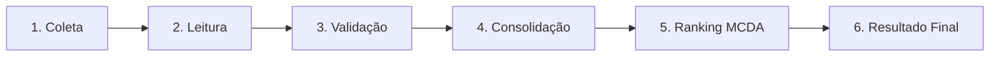

# 🚀 Automação Inteligente do Processo de Seleção de Fornecedores (LG Electronics)
> **Avaliação 03 — Técnicas de Hyperautomation**  
> **Professor:** Moisés Levy | **Turma:** T02 — 2026  
> **Área:** Suprimentos / Procurement & Global Sourcing — LG Electronics do Brasil  

---

## 📋 Sumário Executivo do Projeto

Este repositório contém a solução completa de **Hyperautomation** desenvolvida para automatizar a esteira de ponta a ponta na seleção, validação e ranqueamento ponderado de propostas comerciais de fornecedores industriais.

### 🔄 Fluxo de Pipeline (6 Etapas)


---

## 👥 Divisão de Papéis e Responsabilidades da Equipe

A arquitetura modular do projeto foi desenhada para permitir o trabalho paralelo e integrado entre os **3 membros da equipe**, divididos em 2 etapas de negócio por integrante, além da infraestrutura de engenharia de software:

| Membro | Etapas do Pipeline | Módulos no Código | Responsabilidades Principais |
| :--- | :--- | :--- | :--- |
| **Membro 1** *(Sannyer)* | **Etapa 1: Coleta**<br>**Etapa 2: Leitura**<br>*(+ Infra & DevOps)* | `src/etapa1_coleta/`<br>`src/etapa2_leitura/`<br>`Dockerfile`<br>`docker-compose.yml`<br>`.github/workflows/` | • Coleta do status cadastral no Painel Web (`HTTP:8000` e fallback local).<br>• Varredura e listagem dos arquivos de propostas (`.xlsx`, `.csv`).<br>• Leitura e extração estruturada de dados multiformato.<br>• Leitura de critérios e template de ranking.<br>• Pipeline CI/CD, Containerização Docker e Testes de Integração/Regressão. |
| **Membro 2** *(Ericle)*| **Etapa 3: Validação**<br>**Etapa 4: Consolidação** | `src/etapa3_validacao/`<br>`src/etapa4_consolidacao/` | • Validação de compliance com status web (identificação de status *Bloqueado*).<br>• Validação técnica de integridade (rejeição de valores negativos/nulos para Custo, Prazo, Capacidade).<br>• Identificação e segregação de propostas inválidas (ex: *Fornecedor D*).<br>• Consolidação de registros válidos em DataFrame unificado e tipado. |
| **Membro 3** *(Kauã)* | **Etapa 5: Ranking**<br>**Etapa 6: Resultado** | `src/etapa5_ranking/`<br>`src/etapa6_resultado/` | • Algoritmo de decisão multicritério (MCDA Ponderado) com normalização relativa.<br>• Aplicação dos pesos de negócio (Custo 40%, Prazo 25%, Capacidade 20%, Qualidade 15%).<br>• Ordenação e classificação das posições (1º, 2º, 3º lugar...).<br>• Preenchimento do `modelo_ranking.xlsx` e gravação em `output/ranking_final.xlsx`. |

---

## 🏛️ Estrutura do Repositório

```text
hyperautomation-av3/
├── .github/
│   └── workflows/
│       └── ci.yml                 # Pipeline CI/CD GitHub Actions (Lint, Pytest, Docker)
├── docs/                         # Documentação oficial (PDD LG e Guia da Avaliação)
│   ├── AVALIAÇÃO 03 - Equipe — AUTOMAÇÃO INTELIGENTE DO PROCESSO DE SELEÇÃO DE FORNECEDORES.pdf
│   └── PDD_Processo_Selecao_Fornecedores_LG.pdf
├── logs/                         # Registros de execução e auditoria SOX
│   ├── auditoria.json            # Relatório JSON estruturado de auditoria
│   └── execucao.log              # Logs detalhados com timestamp
├── output/                       # Artefatos gerados pelo robô
│   └── ranking_final.xlsx        # Planilha final no modelo oficial preenchido
├── resources/                    # Dados de entrada simulados
│   ├── 01_SELECAO_FORNECEDORES/
│   │   ├── criterios_ranking.xlsx
│   │   ├── modelo_ranking.xlsx
│   │   ├── propostas/
│   │   │   ├── proposta_fornecedor_A.xlsx
│   │   │   ├── proposta_fornecedor_B.csv
│   │   │   ├── proposta_fornecedor_C.xlsx
│   │   │   └── proposta_invalida_fornecedor_D.xlsx
│   │   └── web/
│   │       └── painel_fornecedores_fake.html
│   └── INSTRUCOES_GERAIS/
│       └── README_EQUIPE.md
├── src/                          # Código-fonte modular da solução
│   ├── __init__.py
│   ├── config.py                 # Gestão de variáveis .env, caminhos e constantes
│   ├── logger.py                 # Sistema de logging e auditoria SOX
│   ├── main.py                   # Orquestrador ponta a ponta do robô
│   ├── etapa1_coleta/            # [Membro 1] Coleta web e de arquivos
│   ├── etapa2_leitura/           # [Membro 1] Leitura de Excel, CSV e templates
│   ├── etapa3_validacao/         # [Membro 2] Regras de negócio e compliance
│   ├── etapa4_consolidacao/      # [Membro 2] Consolidação e tipagem de dados
│   ├── etapa5_ranking/           # [Membro 3] Normalização e MCDA ponderado
│   └── etapa6_resultado/         # [Membro 3] Exportação final em modelo_ranking.xlsx
├── tests/                        # Suíte completa de testes automatizados (pytest)
│   ├── test_coleta.py
│   ├── test_leitura.py
│   ├── test_validacao.py
│   ├── test_consolidacao.py
│   ├── test_ranking.py
│   ├── test_resultado.py
│   └── test_integration.py       # Testes de integração e regressão
├── .env                          # Variáveis de ambiente locais
├── .env.example                  # Modelo de variáveis de ambiente
├── .gitignore                    # Regras de exclusão do Git
├── Dockerfile                    # Container Docker com TZ America/Manaus
├── docker-compose.yml            # Orquestração do robô + servidor web simulado
├── pytest.ini                    # Configuração de execução de testes
├── requirements.txt              # Dependências de produção
├── requirements-dev.txt          # Dependências de desenvolvimento e testes
└── README.md                     # Este guia completo do projeto
```

---

## ⚙️ Pré-Requisitos e Configuração do Ambiente

### 1. Clonar o Repositório e Criar o Ambiente Virtual
```bash
git clone <URL_DO_REPOSITORIO_GITHUB>
cd hyperautomation-av3

# Criar ambiente virtual Python 3.12
python -m venv venv

# Ativar ambiente virtual
# No Windows (PowerShell):
.\venv\Scripts\Activate.ps1
# No Linux/macOS:
source venv/bin/activate
```

### 2. Instalar Dependências
```bash
pip install -r requirements-dev.txt
```

### 3. Configurar Variáveis de Ambiente (`.env`)
Copie o `.env.example` para `.env` (já pré-configurado com timezone `America/Manaus`):
```bash
cp .env.example .env
```

---

## 🏃 Como Executar a Solução

### Opção A: Execução Local com Servidor Web Simulado

1. **Terminal 1 — Iniciar o Painel Web Simulado:**
   ```bash
   python -m http.server 8000
   ```
   *(O painel estará acessível em `http://localhost:8000/resources/01_SELECAO_FORNECEDORES/web/painel_fornecedores_fake.html`)*

2. **Terminal 2 — Executar o Robô de Hyperautomation:**
   ```bash
   python src/main.py
   ```

*(Nota: O robô possui fallback inteligente. Se o servidor HTTP não estiver rodando, ele efetua a leitura direta de contingência do arquivo HTML local).*

---

### Opção B: Execução Completa via Docker Compose
Para rodar em ambiente isolado de produção com um único comando:
```bash
docker compose up --build
```
Isso inicializa tanto o servidor web simulado na porta 8000 quanto o robô de automação com o timezone configurado para `America/Manaus`.

---

## 🧪 Execução da Suíte de Testes Automatizados

O projeto conta com **20 testes automatizados** cobrindo testes unitários, de validação de dados negativos, cálculo de ranking, integração ponta a ponta e regressão:

```bash
# Executar todos os testes com pytest
python -m pytest

# Executar com relatório de cobertura de código
python -m pytest --cov=src --cov-report=term-missing
```

---

## 📊 Regras de Negócio e Fórmula Matemática do Ranking (MCDA)

Conforme definido no edital da Avaliação 3 e no PDD da LG Electronics:

### Pesos e Direções dos Critérios:
* **Custo:** Peso **40% (0.40)** — Direção: *Menor é melhor*
* **Prazo (Lead Time):** Peso **25% (0.25)** — Direção: *Menor é melhor*
* **Capacidade:** Peso **20% (0.20)** — Direção: *Maior é melhor*
* **Qualidade:** Peso **15% (0.15)** — Direção: *Maior é melhor*

### Fórmulas de Normalização (Escala 0 a 100):
- **Critérios de Menor valor (Custo e Prazo):**
  $$\text{Score} = \left( \frac{\text{Menor Valor do Mercado}}{\text{Valor da Proposta}} \right) \times 100$$
- **Critérios de Maior valor (Capacidade e Qualidade):**
  $$\text{Score} = \left( \frac{\text{Valor da Proposta}}{\text{Maior Valor do Mercado}} \right) \times 100$$

### Score Global Ponderado:
$$\text{Nota Final} = (\text{Score}_{\text{Custo}} \times 0.40) + (\text{Score}_{\text{Prazo}} \times 0.25) + (\text{Score}_{\text{Capacidade}} \times 0.20) + (\text{Score}_{\text{Qualidade}} \times 0.15)$$

---

## 🛡️ Defesa Técnica (Respostas para a Banca Avaliadora)

### 1. Como o robô identifica uma proposta inválida?
O robô possui um mecanismo duplo de validação em camadas na **Etapa 3 (`src/etapa3_validacao/validator.py`)**:
1. **Camada Cadastral / Compliance Web:** Consulta a tabela HTML do painel web simulado da LG (`painel_fornecedores_fake.html`). Se o status cadastral do fornecedor for `Bloqueado`, `Inativo` ou `Suspenso`, a proposta é sinalizada imediatamente.
2. **Camada de Integridade Numérica e Regras de Negócio:** Aplica asserções estritas que barram valores negativos ou nulos (`<= 0`) para `Custo`, `Prazo_Dias` e `Capacidade`, além de checar se a `Qualidade` está no intervalo `[0, 100]`. Exemplo: A proposta do **Fornecedor D** apresenta `Custo = -50`, `Prazo = -2` e `Capacidade = -100`, sendo prontamente detectada e rejeitada.

### 2. Como os pesos são aplicados?
Os pesos são carregados dinamicamente a partir do arquivo oficial `criterios_ranking.xlsx` (com fallback no `config.py` para Custo 40%, Prazo 25%, Capacidade 20%, Qualidade 15%). Na **Etapa 5 (`src/etapa5_ranking/ranker.py`)**, cada critério normalizado é multiplicado pelo seu respectivo peso decimal e somado linearmente para formar a `Nota_Final`.

### 3. Como funciona a normalização dos valores?
Utiliza-se a técnica de **Scoring Relativo ao Benchmark de Mercado (MCDA)**:
- Para atributos de custo/prazo onde o menor valor é o mais vantajoso, a melhor cotação recebe nota máxima (100) e as demais pontuações decrescem inversamente à distância do menor valor: $\text{Score} = (\text{Min} / \text{Valor}) \times 100$.
- Para atributos de capacidade/qualidade onde o maior valor é o melhor, a maior oferta recebe nota 100 e as demais são avaliadas proporcionalmente: $\text{Score} = (\text{Valor} / \text{Max}) \times 100$.

### 4. Como a equipe evita que um fornecedor inválido entre no ranking?
O pipeline implementa o padrão arquitetural de **Data Filtering Gateway**: a saída da Etapa 3 segrega o conjunto de dados em duas coleções distintas: `propostas_validas` e `propostas_rejeitadas`. O módulo de cálculo MCDA (Etapa 5) consome **exclusivamente** o DataFrame consolidado de propostas válidas, garantindo isolamento total. Os fornecedores rejeitados são encaminhados diretamente para a Etapa 6, figurando com a posição `Desclassificado`, `Nota_Final = 0.00` e a justificativa técnica auditável no campo `Observacao`.

### 5. Como o processo se recupera de uma falha?
- **Resiliência de Rede:** Na coleta web, o módulo tenta requisição HTTP ao servidor local e, em caso de indisponibilidade ou timeout, aciona o mecanismo de fallback automático para leitura do arquivo HTML local em disco.
- **Tolerância a Formatos:** O leitor suporta variações de delimitadores em CSV (`;` e `,`) e padronização automática de cabeçalhos de colunas com acentos/espaços.
- **Tratamento de Exceções e Auditoria:** Toda a pipeline é envolvida em blocos `try/except` que capturam exceções sem derrubar o sistema silenciosamente, registrando o traceback na trilha de auditoria e no log de execução.

### 6. Como o resultado é auditado?
- **Trilha de Auditoria Digital SOX (`logs/auditoria.json`):** Salva um snapshot estruturado com carimbo de tempo ISO contendo: lista de propostas recebidas, propostas aprovadas, propostas rejeitadas com motivo detalhado, memória de cálculo com scores parciais por critério e ranking final.
- **Log Operacional Contínuo (`logs/execucao.log`):** Registra eventos em formato cronológico com severidade (`INFO`, `WARNING`, `ERROR`, `CRITICAL`).
- **Planilha Oficial Homologada (`output/ranking_final.xlsx`):** Preenche fielmente as colunas do template `modelo_ranking.xlsx` (`Posicao`, `Fornecedor`, `Nota_Final`, `Status`, `Observacao`).

---

## 🔀 Fluxo de Trabalho Git Recomendado para a Equipe

Para os colegas iniciarem o desenvolvimento colaborativo no GitHub:

1. **Branch Principal:** `main` (código estável e validado pelo CI/CD).
2. **Branches de Trabalho por Membro:**
   - `feature/etapa1-coleta` e `feature/etapa2-leitura` (Membro 1)
   - `feature/etapa3-validacao` e `feature/etapa4-consolidacao` (Membro 2)
   - `feature/etapa5-ranking` e `feature/etapa6-resultado` (Membro 3)
3. **Pull Requests:** Antes do merge na `main`, o GitHub Actions executa automaticamente a suíte de testes e valida a integridade do código.
